TRƯỜNG ĐẠI HỌC / KHOA CÔNG NGHỆ THÔNG TIN
───────────────────────────────────────
TÀI LIỆU ĐẶC TẢ YÊU CẦU SẢN PHẨM (PRD) — **bản đồng bộ mã nguồn (TravelGuide repo)**
ỨNG DỤNG TOUR DU LỊCH ẨM THỰC VĨNH KHÁNH — KẾT HỢP THUYẾT MINH TỰ ĐỘNG (TTS / Audio)
(.NET MAUI + ASP.NET Core Admin Web + ASP.NET Core Tourist API + SQL Server)
Phiên bản tài liệu: **1.1-code** — Tháng 04/2026 — Trạng thái: Bản chỉnh theo implementation

## Lịch sử thay đổi

| Phiên bản | Ngày | Mô tả |
|---|---|---|
| 1.0 | 04/2026 | Bản PRD mẫu (React Native / React.js / stack giả định) |
| 1.1-code | 04/2026 | Rà soát 100% theo mã: MAUI, Minimal API, SQL Server, luồng thật |

## 1. Tổng quan dự án

### 1.1. Giới thiệu

Hệ thống gồm **ba thành phần triển khai trong solution**:

| Thành phần | Công nghệ (theo code) | Vai trò |
|---|---|---|
| **TravelGuide** | .NET MAUI (`UseMauiMaps`, Mapbox token bootstrap, `Plugin.Maui.Audio`, `ZXing.Net.Maui`, LocalizationResourceManager) | App cho du khách: đăng nhập/đăng ký, danh sách POI, bản đồ, quét QR, lịch sử quét, âm thanh/TTS, đa ngôn ngữ UI |
| **TravelGuide.AdminWeb** | ASP.NET Core, `WEB/app.js` SPA tối giản, Swagger | Cổng **admin** và **chủ quán (owner)**: CRUD POI (có duyệt), QR POI, dịch đa ngôn ngữ (MyMemory), tài khoản, export JSON, dashboard du khách |
| **TravelGuide.API** | ASP.NET Core Minimal API + Swagger | API **du khách**: auth token RAM, tier free/premium, redeem premium, kiểm tra quyền POI, xác nhận “mở khóa” POI (demo giá), log quét QR, public POI |

**Dữ liệu POI** trên app: ưu tiên `GET /api/public/pois` (cấu hình base URL trong `DatabaseService` / `Preferences`), fallback **`extra_places.json`** nhúng hoặc cạnh binary; có cache ~30s và SQLite cục bộ `travelguide-local.db3`.

**Thuyết minh:** `NarrationEngine` — nếu `AudioUrl` hợp lệ thì tải và phát qua `IAudioManager`; nếu không thì **`TextToSpeech`** (MAUI) với văn bản build từ POI theo ngôn ngữ hiện tại.

**Geofence / GPS:** `GeofenceEngine` so khớp vị trí với **bán kính `Radius` (mét) từng POI** trong dữ liệu; debounce **3s** trong vùng; cooldown **60s** sau khi đã trigger một POI; chọn POI khi chồng vùng theo **Priority** giảm dần rồi khoảng cách. `GpsBackgroundService` (Android) hỗ trợ theo dõi nền theo platform.

### 1.2. Mục tiêu (khớp chức năng đã có)

- Số hoá trải nghiệm tham quan khu ẩm thực Vĩnh Khánh với **POI địa lý + QR + audio/TTS**.
- Hỗ trợ **đa ngôn ngữ giao diện** (vi, en, ja, ko, zh) qua ResX + `AppLanguage`.
- Cho phép **du khách có tài khoản** (tier **free/premium**), **mở khóa POI** theo giá cấu hình, **ghi nhận lịch sử quét QR**.
- Cho phép **chủ quán** gửi nội dung POI **chờ duyệt**; **admin** duyệt/từ chối, quản trị user, xem thống kê, xuất `extra_places.json`.

### 1.3. Phạm vi dự án

| Hạng mục | Chi tiết (theo code) |
|---|---|
| Nền tảng | **.NET MAUI** (mobile) + **ASP.NET Core** (AdminWeb + Tourist API), **SQL Server** (script `TravelGuide.sql` + migration nhẹ trong `TouristDb` / `TravelGuideDb`) |
| Đối tượng | Du khách (`TouristUser`); Admin / Chủ quán (`UserAccount` role `admin` \| `owner`) |
| Địa bàn | POI mẫu / cấu hình cho khu ẩm thực Vĩnh Khánh (dữ liệu & bản đồ tùy seed) |
| Ngôn ngữ | UI: **vi, en, ja, ko, zh**; nội dung POI: trường đa ngôn ngữ + dịch MyMemory (Admin Web) |
| Ngoài phạm vi hiện tại | OAuth Google/Facebook; quên mật khẩu OTP; tour package riêng; đánh giá sao trong app; push FCM; thanh toán cổng thật (chỉ luồng demo số tiền cấu hình) |

### 1.4. Stakeholders

| Vai trò | Đại diện trong hệ thống | Quan tâm chính |
|---|---|---|
| Du khách | `TouristUser` + app MAUI | Đăng nhập, POI, map, QR, audio/TTS, premium/unlock, lịch sử quét |
| Chủ quán | `UserAccount` role **owner** + Admin Web | Tạo/sửa POI của mình, trạng thái pending, QR, bản dịch |
| Admin | `UserAccount` role **admin** | Duyệt POI, CRUD toàn cục, user, export, dashboard |
| Nhóm phát triển | Solution `TravelGuide.sln` | Mã rõ ràng, cấu hình `appsettings` / token Mapbox |

## 2. Yêu cầu chức năng

### 2.1. Mobile App — Du khách

#### 2.1.1. Tài khoản & phiên (`TravelGuide.API`)

| ID | Tên | Mô tả (theo code) | Actor |
|---|---|---|---|
| F01 | Đăng ký | `POST /api/tourist/auth/register` — username ≥3, password ≥6, displayName ≥2; tier chỉ **free** (premium bị từ chối nếu đăng ký trực tiếp premium) | Khách |
| F02 | Đăng nhập | `POST /api/tourist/auth/login` — trả **token** hex lưu `Preferences` (Bearer gửi kèm các API cần auth) | Khách |
| F03 | Phiên hiện tại | `GET /api/tourist/auth/me` — userId, username, displayName, **accountTier** | Khách |
| F04 | Kích hoạt Premium | `POST /api/tourist/premium/redeem` — `TouristPricing:PremiumActivationVnd` (mặc định 60000) + **claim code** hợp lệ trong DB | Khách |
| F05 | Quyền vào POI | `GET /api/tourist/pois/{id}/access` — `hasAccess` nếu **premium** hoặc đã **unlock** POI; không thì `requiresPurchase` + `DefaultPoiUnlockVnd` (mặc định 1000) | Khách |
| F06 | Xác nhận mở khóa POI | `POST /api/tourist/pois/{id}/purchase-confirm` — số tiền phải khớp cấu hình; ghi `TouristPoiUnlock` | Khách |
| F07 | Log quét QR | `POST /api/tourist/pois/scan-log` — poiId, tên, eventType, amount, device… | Khách |
| F08 | Lịch sử quét | `GET /api/tourist/pois/my-scan-history` | Khách |

**Không có trong code:** OAuth; quên mật khẩu; avatar; bookmark tour trong app (bảng `TouristFavorite` phục vụ báo cáo phía admin SQL, không có endpoint tourist trong `TravelGuide.API` hiện tại).

#### 2.1.2. Khám phá POI & điều hướng (MAUI)

| ID | Tên | Mô tả | Actor |
|---|---|---|---|
| F10 | Trang đăng nhập | `TouristLoginPage` — bắt buộc trước `HomePage` (Shell route) | Khách |
| F11 | Đăng ký | `TouristRegisterPage` | Khách |
| F12 | Trang chủ POI | `HomePage` — tải danh sách `DatabaseService.GetPlacesAsync`, tìm kiếm theo text, đổi ngôn ngữ UI (5 mã) | Khách |
| F13 | Bản đồ | `MapPage` + `UseMauiMaps` + Mapbox (token) | Khách |
| F14 | Chi tiết điểm | `PlaceDetailPage` | Khách |
| F15 | Quét QR | `QrScannerPage` (ZXing) | Khách |
| F16 | Lịch sử quét | `QrScanHistoryPage` | Khách |
| F17 | Trang âm thanh | `AudioPage` + `MiniPlayerView` gắn `NarrationEngine` | Khách |
| F18 | Geofence narration | `GeofenceEngine` + `GpsBackgroundService` (Android) kích hoạt `NarrationEngine` | Hệ thống / Khách |

#### 2.1.3. Thuyết minh

| ID | Tên | Mô tả | Actor |
|---|---|---|---|
| F20 | Audio URL | Phát file remote khi có URL hợp lệ | Hệ thống |
| F21 | TTS fallback | `TextToSpeech.Default.SpeakAsync` khi không phát remote được | Hệ thống |
| F22 | Dừng / hàng đợi | `NarrationEngine.StopAsync`, hàng đợi nội bộ | Khách |

**Không có:** chọn giọng Nam/Nữ riêng; subtitle sync nâng cao (chỉ nội dung POI theo field).

### 2.2. Admin Web — Admin & Chủ quán

**Auth:** `POST /api/auth/login` — token lưu RAM server (`AuthStore`); Bearer cho các API.

| ID | Tên | Mô tả | Actor |
|---|---|---|---|
| A01 | Danh sách POI | `GET /api/pois` — admin: mọi trạng thái; owner: POI của mình | Admin / Owner |
| A02 | Public POI (sync app) | `GET /api/public/pois` — chỉ published; gọi dịch tự động theo `lang` | Hệ thống |
| A03 | Tạo POI | `POST /api/pois` — admin → **published**; owner → **pending** + `OwnerUserId` | Admin / Owner |
| A04 | Sửa POI | `PUT /api/pois/{id}` — owner chỉ POI của mình | Admin / Owner |
| A05 | Xóa POI | `DELETE /api/pois/{id}` — **admin only** | Admin |
| A06 | Approve / Reject | `PUT .../approve` \| `.../reject` — admin | Admin |
| A07 | QR POI | `POST /api/pois/{id}/qrcode` | Admin / Owner (theo quyền POI) |
| A08 | Audio list | `GET /api/audio` — admin: toàn bộ; owner: theo POI sở hữu | Admin / Owner |
| A09 | Dịch | `GET/PUT /api/translations/{id}` — owner chỉ POI của mình | Admin / Owner |
| A10 | Tài khoản | `GET/POST/PUT/DELETE /api/accounts` — **admin** | Admin |
| A11 | Khóa / duyệt owner | `PUT .../lock`, `.../approve-registration`, `.../reject-registration` | Admin |
| A12 | Export | `GET /api/export/extra_places.json` — admin | Admin |
| A13 | Dashboard du khách | `GET /api/tourists/overview`, `GET /api/tourists/poi-scan-dashboard` — admin | Admin |
| A14 | Đăng ký chủ quán | `POST /api/auth/register` — role owner, `RegistrationApproved=false` đến khi admin duyệt | Owner |

**Không có trong code:** quản lý “Tour” CRUD riêng; push notification; moderation đánh giá trong Admin Web.

## 3. Yêu cầu phi chức năng

| Loại | Tiêu chí | Ghi chú theo code |
|---|---|---|
| Bảo mật | Token | Tourist API dùng token **random hex** lưu trong `ConcurrentDictionary`; token là in-memory session và sẽ mất khi service khởi động lại. |
| Bảo mật | Mật khẩu | Mật khẩu được hash bằng `PasswordTools` (SHA256 hex) trước khi so khớp/lưu. |
| Hiệu năng | Cache POI app | ~30 giây (`DatabaseService.CacheDuration`). |
| Dữ liệu | SQL Server | `TravelGuide.sql` + bảng bổ sung trong `TouristDb.InitializeAsync` (`TouristPoiUnlock`, `TouristPoiQrScanLog`, `PremiumClaimCode`, …). |
| TTS / Geo | Độ trễ | Kích hoạt theo `GeofenceEngine` với debounce 3 giây; độ trễ thực tế còn phụ thuộc mạng (khi phát audio URL) và thiết bị. |

## 4. Sơ đồ Use Case (PlantUML — cập nhật theo code)

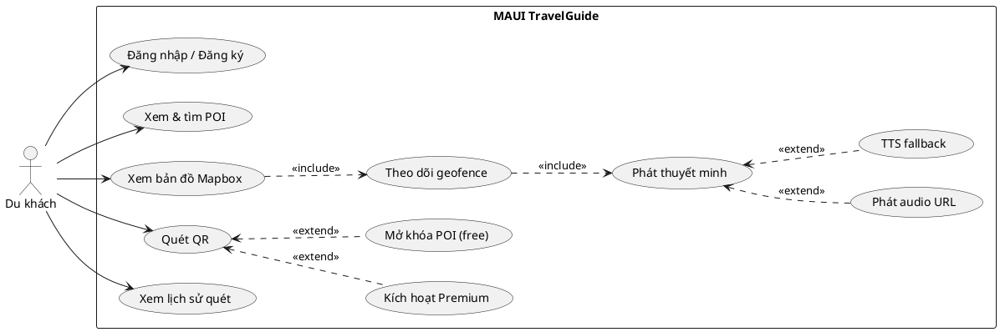

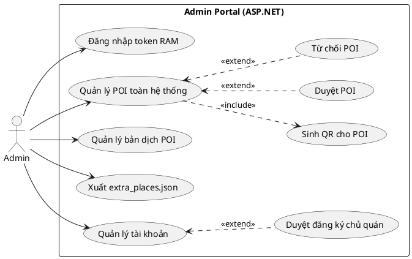

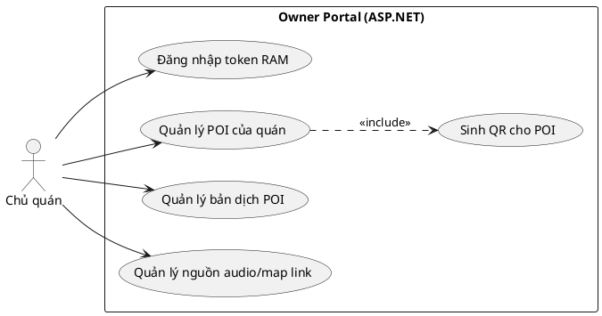

## 5. Sequence chi tiết theo Use Case (tên hàm/object đúng theo code)

### 5.1 Mobile — `Đăng nhập / Đăng ký` (`UC1`)

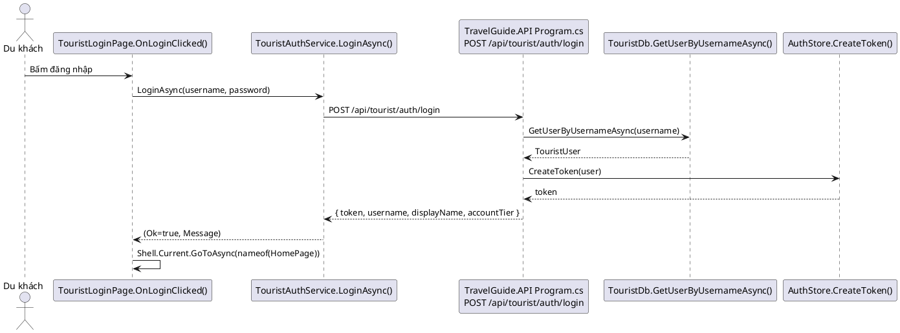

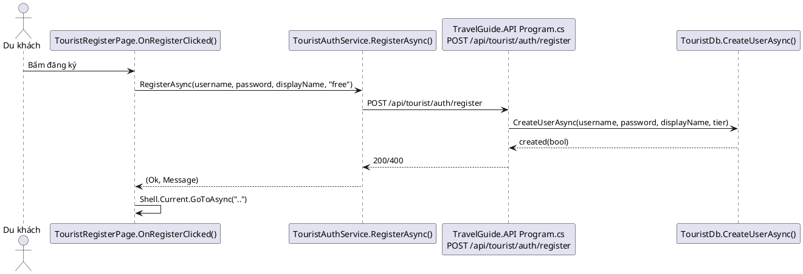

### 5.2 Mobile — `Xem & tìm POI` (`UC2`)

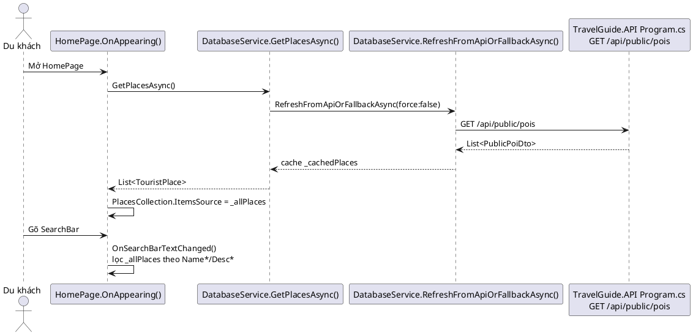

### 5.3 Mobile — `Xem bản đồ Mapbox` (`UC3`)

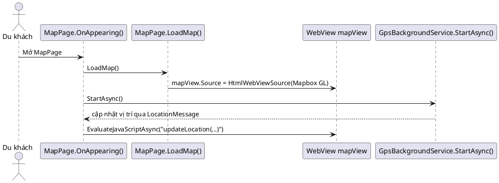

### 5.4 Mobile — `Theo dõi geofence` (`UC4`)

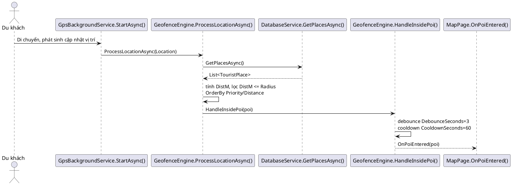

### 5.5 Mobile — `Phát thuyết minh` (`UC5`, `UC5A`, `UC5B`)

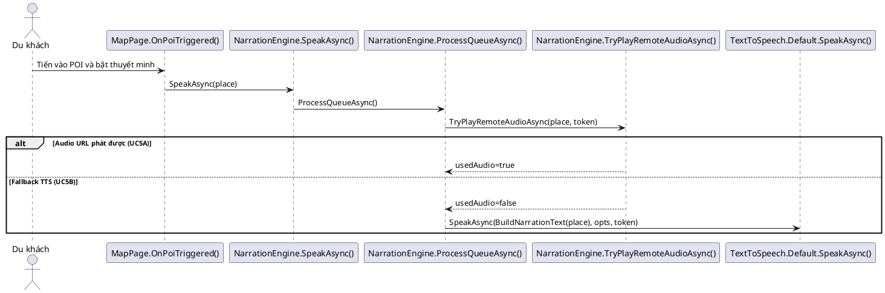

### 5.6 Mobile — `Quét QR` (`UC6`)

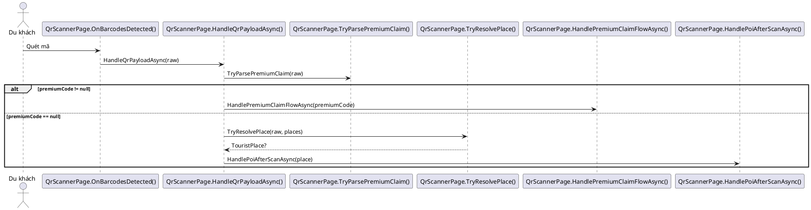

### 5.6.1 Mở rộng `UC8` — `Kích hoạt Premium` (từ Quét QR)

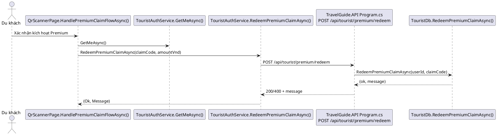

### 5.6.2 Mở rộng `UC9` — `Mở khóa POI (free)` (từ Quét QR)

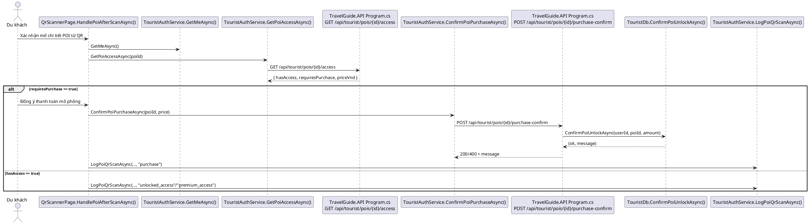

### 5.7 Mobile — `Xem lịch sử quét` (`UC7`)

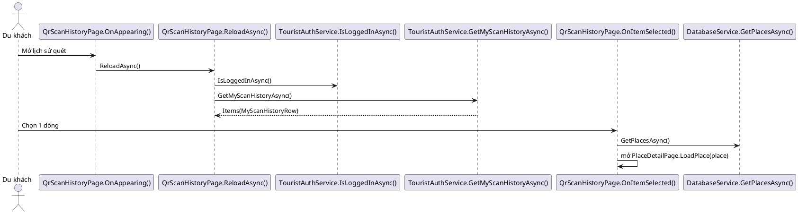

### 5.8 Admin Portal — `Đăng nhập token RAM` (`AL`)

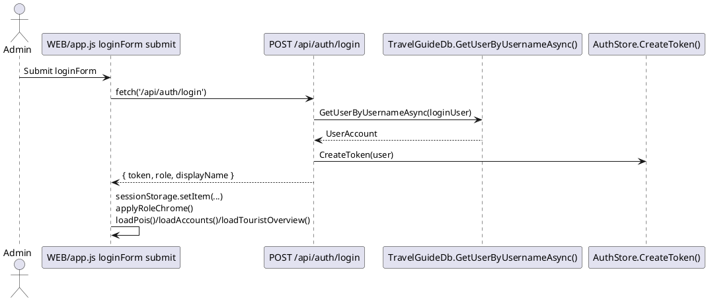

### 5.9 Admin Portal — `Quản lý POI toàn hệ thống` (`APA`, `APQR`, `APAP`, `APRJ`)

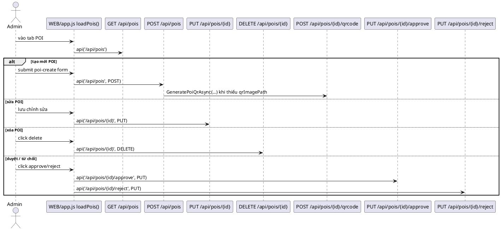

### 5.10 Admin Portal — `Quản lý bản dịch POI` (`AQT`)

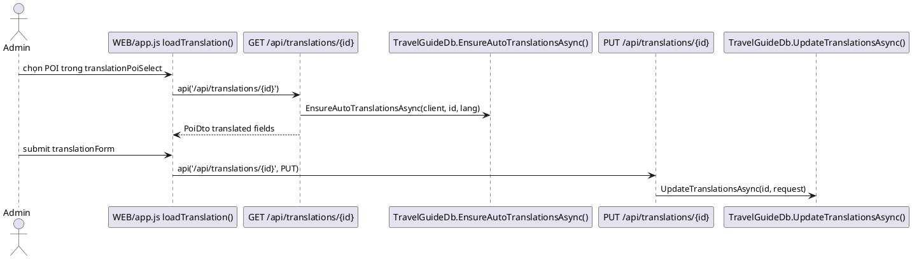

### 5.11 Admin Portal — `Xuất extra_places.json` (`AQE`)

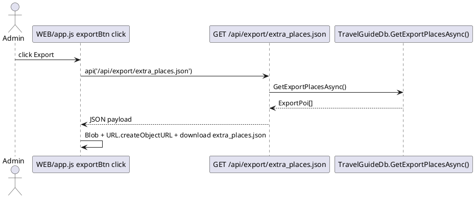

### 5.12 Admin Portal — `Quản lý tài khoản` (`AUA`, `AUAO`)

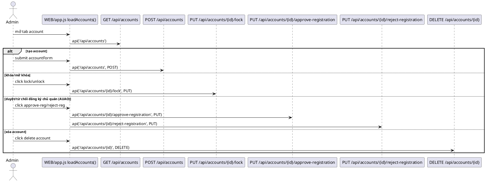

### 5.13 Owner Portal — `Đăng nhập token RAM` (`OL`)

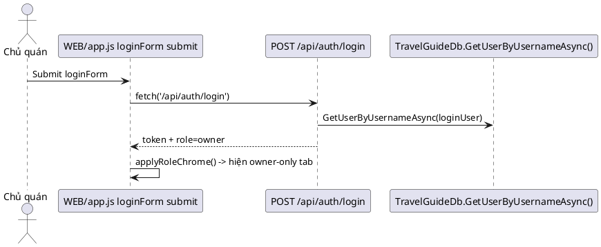

### 5.14 Owner Portal — `Quản lý POI của quán` (`OPO`, `OPQR`)

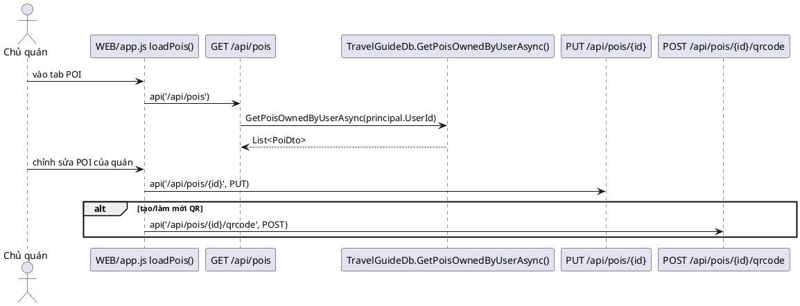

### 5.15 Owner Portal — `Quản lý bản dịch` (`OQT`)

```plantuml
@startuml SEQ_OQT_OwnerTranslations
actor "Chủ quán" as O
participant "WEB/app.js loadTranslation()" as JS
participant "GET /api/translations/{id}" as GETTR
participant "PUT /api/translations/{id}" as PUTTR

O -> JS: chọn POI của quán
JS -> GETTR: api('/api/translations/{id}')
O -> JS: submit translationForm
JS -> PUTTR: api('/api/translations/{id}', PUT)
@enduml
```

### 5.16 Owner Portal — `Quản lý nguồn audio/map link` (`OQA`)

```plantuml
@startuml SEQ_OQA_AudioMap
actor "Chủ quán" as O
participant "WEB/app.js renderAudioSources()" as JS
participant "WEB/app.js audioTableWrap click" as SAVE
participant "PUT /api/pois/{id}" as PUTPOI

O -> JS: mở tab audioTab
JS -> JS: renderAudioSources() từ pois[]
O -> SAVE: click nút Lưu từng dòng
SAVE -> PUTPOI: api('/api/pois/{id}', PUT)\n(payload: ...p, audioUrl, mapLink)
SAVE -> JS: loadPois(); renderAudioSources()
@enduml
```

## 6. Activity Diagram (PlantUML)

### 6.1 Mobile — Luồng chính Du khách

```plantuml
@startuml ACT_Mobile_MainFlow
start
:Mở app (AppShell -> TouristLoginPage);
if (Đã có token hợp lệ?) then (Chưa)
  :Đăng nhập / Đăng ký;
  if (Auth thành công?) then (Không)
    :Hiển thị lỗi đăng nhập;
    stop
  endif
endif
:Xem & tìm POI\n(HomePage + DatabaseService.GetPlacesAsync);
if (Chọn chức năng?) then (Map)
  :Xem bản đồ Mapbox;
  :Theo dõi geofence\n(GpsBackgroundService.StartAsync + GeofenceEngine.ProcessLocationAsync);
  if (Vào vùng POI?) then (Có)
    :Phát thuyết minh;
    if (Audio URL phát được?) then (Có)
      :Phát audio URL;
    else (Không)
      :TTS fallback;
    endif
  endif
elseif (QR)
  :Quét QR\n(OnBarcodesDetected -> HandleQrPayloadAsync);
  if (Mã premium?) then (Có)
    :Kích hoạt Premium\n(HandlePremiumClaimFlowAsync);
  else (POI)
    :HandlePoiAfterScanAsync;
    if (requiresPurchase?) then (Có)
      :Mở khóa POI (free)\n(ConfirmPoiPurchaseAsync);
    endif
  endif
elseif (Audio)
  :Mở AudioPage\n(phát danh sách qua NarrationEngine);
else (History)
  :Xem lịch sử quét\n(GetMyScanHistoryAsync);
endif
stop
@enduml
```

### 6.2 Admin Portal — Quản trị POI và tài khoản

```plantuml
@startuml ACT_Admin_Portal
start
:Mở WEB/index.html;
:Submit loginForm;
if (POST /api/auth/login OK?) then (Không)
  :Thông báo đăng nhập thất bại;
  stop
endif
:Đăng nhập token RAM thành công;
:applyRoleChrome() role=admin;
repeat
  if (Chọn module?) then (Quản lý POI)
    :GET /api/pois;
    if (Tạo/Sửa POI?) then (Có)
      :POST/PUT /api/pois;
      if (Thiếu qrImagePath?) then (Có)
        :Sinh QR cho POI\nPOST /api/pois/{id}/qrcode;
      endif
    endif
    if (Xóa POI?) then (Có)
      :DELETE /api/pois/{id};
    endif
    if (Duyệt/Từ chối?) then (Có)
      :Duyệt/Từ chối POI\nPUT /api/pois/{id}/approve hoặc /reject;
    endif
  elseif (Bản dịch POI)
    :GET /api/translations/{id};
    :PUT /api/translations/{id};
  elseif (Tài khoản web)
    :GET /api/accounts;
    :POST/PUT/DELETE /api/accounts;
    :PUT /api/accounts/{id}/lock;
    :Duyệt/Từ chối đăng ký chủ quán\nPUT /api/accounts/{id}/approve-registration|reject-registration;
  else (Export)
    :GET /api/export/extra_places.json;
  endif
repeat while (Tiếp tục thao tác?) is (Có)
stop
@enduml
```

### 6.3 Owner Portal — Quản lý nội dung quán

```plantuml
@startuml ACT_Owner_Portal
start
:Mở WEB/index.html;
:Submit loginForm (owner);
if (POST /api/auth/login OK?) then (Không)
  :Thông báo lỗi / chờ duyệt / bị khóa;
  stop
endif
:Đăng nhập token RAM thành công;
:applyRoleChrome() role=owner;
repeat
  if (Chọn module?) then (Quản lý POI quán)
    :GET /api/pois (owner scope);
    if (Sửa POI?) then (Có)
      :PUT /api/pois/{id};
    endif
    if (Sinh QR?) then (Có)
      :Sinh QR cho POI\nPOST /api/pois/{id}/qrcode;
    endif
  elseif (Bản dịch)
    :GET /api/translations/{id};
    :PUT /api/translations/{id};
  else (Audio/Map)
    :renderAudioSources();
    :audioTableWrap click;
    :PUT /api/pois/{id}\n(audioUrl, mapLink);
  endif
repeat while (Tiếp tục thao tác?) is (Có)
stop
@enduml
```

## 7. Mô hình dữ liệu (SQL Server — chính)

| Bảng | Mục đích |
|---|---|
| `UserAccount` | Admin / Owner, khóa, duyệt đăng ký |
| `TouristUser` | Du khách + `AccountTier` free/premium |
| `Poi` | Điểm: tọa độ, `Radius`, đa ngôn ngữ, `AudioUrl`, `Status` published/pending/rejected, `OwnerUserId`, `Priority` |
| `RefreshToken` | (Schema) refresh token tourist — kiểm tra API có dùng hết luồng |
| `TouristFavorite` | Dữ liệu yêu thích — phục vụ báo cáo SQL phía admin |
| `TouristVisitHistory` | Lịch sử view/audio/map |
| `PaymentTransaction` | Giao dịch (schema) |
| `TouristPoiUnlock` | POI đã mở khóa theo user |
| `TouristPoiQrScanLog` | Log quét QR |
| `PremiumClaimCode` | Mã đổi premium |

### 7.1 ERD PlantUML

```plantuml
@startuml ERD_TravelGuide_SQLServer
hide methods
hide stereotypes
skinparam linetype ortho

entity "UserAccount" as UserAccount {
  * Id : int
  --
  Username : nvarchar(120)
  PasswordHash : nvarchar(256)
  DisplayName : nvarchar(200)
  Role : nvarchar(30) <<admin|owner>>
  IsLocked : bit
  RegistrationApproved : bit
}

entity "TouristUser" as TouristUser {
  * Id : int
  --
  Username : nvarchar(100)
  PasswordHash : nvarchar(256)
  DisplayName : nvarchar(200)
  AccountTier : nvarchar(20) <<free|premium>>
}

entity "Poi" as Poi {
  * Id : int
  --
  NameVi : nvarchar(300)
  DescVi : nvarchar(max)
  Latitude : float
  Longitude : float
  Radius : float
  AudioUrl : nvarchar(1000)
  Status : nvarchar(30) <<published|pending|rejected>>
  OwnerUserId : int
  Priority : int
}

entity "RefreshToken" as RefreshToken {
  * Id : bigint
  --
  TouristUserId : int
  TokenHash : nvarchar(256)
  ExpiresAtUtc : datetime2
}

entity "TouristFavorite" as TouristFavorite {
  * Id : bigint
  --
  TouristUserId : int
  PoiId : int
}

entity "TouristVisitHistory" as TouristVisitHistory {
  * Id : bigint
  --
  TouristUserId : int
  PoiId : int
  EventType : nvarchar(30)
  OccurredAtUtc : datetime2
}

entity "PaymentTransaction" as PaymentTransaction {
  * Id : bigint
  --
  TouristUserId : int
  Provider : nvarchar(50)
  ProviderRef : nvarchar(150)
  Amount : decimal(18,2)
  Status : nvarchar(30)
}

entity "TouristPoiUnlock" as TouristPoiUnlock {
  * TouristUserId : int
  * PoiId : int
  --
  AmountVnd : decimal(18,2)
  UnlockedAtUtc : datetime2
}

entity "TouristPoiQrScanLog" as TouristPoiQrScanLog {
  * Id : bigint
  --
  TouristUserId : int
  PoiId : int
  EventType : nvarchar(50)
  AmountVnd : decimal(18,2)
  CreatedAtUtc : datetime2
}

entity "PremiumClaimCode" as PremiumClaimCode {
  * Id : int
  --
  ClaimCode : nvarchar(64)
  AmountVnd : decimal(18,2)
  IsRedeemed : bit
  RedeemedByTouristUserId : int?
}

UserAccount ||--o{ Poi : "OwnerUserId"

TouristUser ||--o{ RefreshToken : has
TouristUser ||--o{ TouristFavorite : likes
TouristUser ||--o{ TouristVisitHistory : visits
TouristUser ||--o{ PaymentTransaction : pays
TouristUser ||--o{ TouristPoiUnlock : unlocks
TouristUser ||--o{ TouristPoiQrScanLog : scans
TouristUser ||--o{ PremiumClaimCode : redeems

Poi ||--o{ TouristFavorite : favored
Poi ||--o{ TouristVisitHistory : viewed
Poi ||--o{ TouristPoiUnlock : unlocked
Poi ||--o{ TouristPoiQrScanLog : scanned
@enduml
```

## 8. UI — màn hình thật (MAUI)

| Màn hình | Mô tả |
|---|---|
| `TouristLoginPage` | Đăng nhập username/password |
| `TouristRegisterPage` | Đăng ký |
| `HomePage` | Danh sách POI, search, chọn ngôn ngữ, điều hướng các trang |
| `MapPage` | Bản đồ + geofence |
| `PlaceDetailPage` | Chi tiết |
| `QrScannerPage` / `QrScanHistoryPage` | QR |
| `AudioPage` + mini player | Phát âm thanh / TTS |

**Admin Web:** giao diện `WEB` (HTML/JS) — không phải React.js.

## 9. Kiến trúc & stack (thực tế)

| Tầng | Công nghệ |
|---|---|
| Mobile | .NET MAUI, Mapbox Maps, ZXing.Net.Maui, Plugin.Maui.Audio |
| Admin + sync | ASP.NET Core, static SPA JS, Swagger |
| Tourist API | ASP.NET Core Minimal API, Swagger |
| DB | Microsoft SQL Server |
| Dịch tự động | MyMemory (HTTP) từ Admin Web |

## 10. Kế hoạch / DoD

Phần roadmap giữ ở mức báo cáo đồ án; **DoD kỹ thuật** nên gồm: build được cả 3 project, chạy SQL seed, cấu hình URL API trên emulator (`10.0.2.2`) vs máy thật.

## 11. Rủi ro

- Token tourist / admin trong **RAM** — mất session khi restart process.
- Phụ thuộc **Mapbox token** và mạng để tải tiles/audio.
- Độ chính xác GPS trong hẻm — đã có debounce/cooldown nhưng vẫn là rủi ro vận hành.

## 12. Phụ lục

| Thuật ngữ | Giải thích |
|---|---|
| POI | Point of Interest — một quán / điểm dừng |
| TTS | Text-to-Speech (MAUI) |
| Owner / Admin | `UserAccount.Role` trong SQL |

**Tham khảo mã:** `TravelGuide/`, `TravelGuide.API/Program.cs`, `TravelGuide.AdminWeb/Program.cs`, `TravelGuide.sql`, `TravelGuide.API/appsettings.json` (`TouristPricing`).

— Hết tài liệu PRD đồng bộ code —
